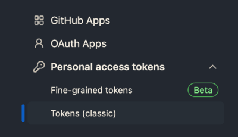

# Logseq Backup Project
## Description
The project aims at backing up Loqseq notes on below places:
1. GitHub
2. Another place in your local computer, like SSD ot hard drive.
---

## Prerequisites
### Basics
* Make sure Docker is available. 

### Feature I : Back up the note for GitHub
1. Set the variable `UPDATE_GITHUB_ENABLED` in .env as `true`.
2. Create your GitHub access token 
    1. follow the path `Setting -> Developer Settings -> Personal Access Token -> Tokens(classic)`
    
    2. Create a new one which is granted with repository accesses.
    3. Paste the generated key to `GITHUB_TOKEN` in .env
3. keep filling related variables.

### Feature II :Back up in another local place
1. Set the variable `FOLDER_UPDATE_ENABLED` in .env as `true`.
2. keep filling related variables.

## Customization
* You can fine tune the frequency of backup in `task-cron` following the conventional cron pattern. (Notice: The leftmost unit presents "minute".)

## Steps
1. Fill the necessary values in .env.
2. Go to the root path of the project and execute below command
    ```bash
    docker compose build && docker compose -d up
    ```
3. To stop the service, execute below command
    ```bash
    docker compose down
    ```

## Notes
* Last updated on 2023/05/09